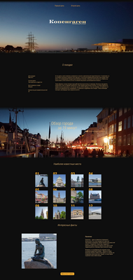
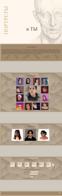
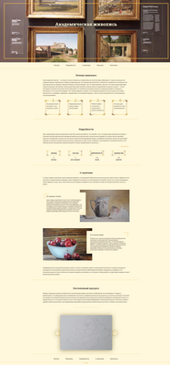
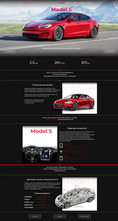

# a-salikhova.github.io

* [Copenhagen](../copenhagen/)
  * 3 pages, flex, grid, slick-slider, fancybox, @media
* [Portrets](../portrets/)
  * landing page, flex, grid, magnific-popup, fancybox.css, JavaScript, @media
* [Painting](../painting/)
  * landing page, flex, slick-slider, @media
* [Tesla](../tesla/)
  * landing page, flex, slick-slider,  JavaScript, @media
* [Gazelkin](../gazelkin/)
  * landing page, flex, slick-slider,  magnific-popup, JavaScript, @keyframes, @media, from figma
* [EWA](../EWA/)
  * landing page, gulp, flex, slick-slider, @media
  ***

|1              |2            |3              | 4              | 
|:------------- |:------------|:--------------|:---------------|
| [Copenhagen](../copenhagen/)| [Portrets](../portrets/)| [Painting](../painting/)| [Tesla](../tesla/)|
| 3 pages |landing page|landing page|landing page| 
|flex|flex|flex|flex|
|grid|grid|-|-|
|slick-slider|-|slick-slider|slick-slider|
|fancybox|fancybox|-|-|
|-|magnific-popup|-|-|
|-|JavaScript|-|JavaScript|
|-|animate|-|-|
|@media|@media|@media|@media|
| |  |  | |
***

|5          | 6        |  7        | 8         |
|:--------- |:---------|:----------|:----------|
| [Gazelkin](../gazelkin/)| [EWA](../EWA/)| -| -|
| landing page|landing page|-|-| 
|flex|flex|-|-|
|slick-slider|slick-slider|-|-|
|magnific-popup|-|-|-|
|JavaScript|-|-|-|
|@keyframes|-|-|-|
|from figma|-|-|-|
|@media|@media|-|-|
|-|gulp|-|-|
|| |-|-|
